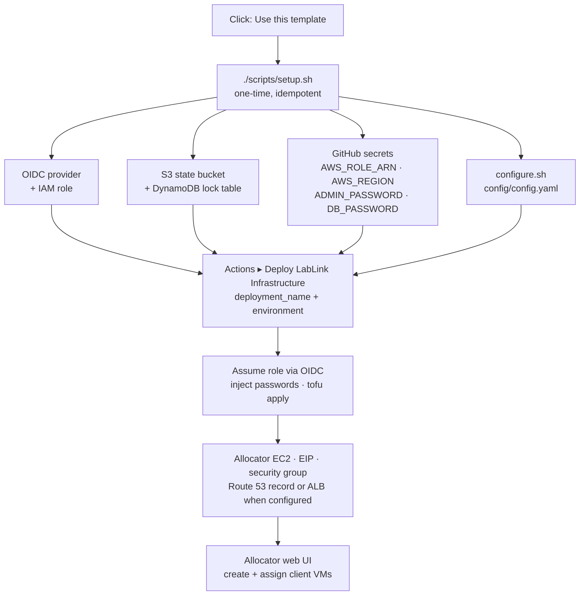

# LabLink Infrastructure Template

> **GitHub Template Repository** for deploying LabLink infrastructure to AWS

[](https://opensource.org/licenses/BSD-2-Clause)
[](https://opentofu.org/)

Deploy your own LabLink infrastructure for cloud-based VM allocation and management. This template uses OpenTofu and GitHub Actions to automate deployment of the LabLink allocator service to AWS.

📖 **Main Documentation**: https://talmolab.github.io/lablink/

## What is LabLink?

LabLink automates deployment and management of cloud-based VMs for running research software. It provides:
- **Web interface** for requesting and managing VMs
- **Automatic VM provisioning** with your software pre-installed
- **GPU support** for ML/AI workloads
- **Chrome Remote Desktop** access to VM GUI
- **Flexible configuration** for different research needs

## Two Deployment Paths

There are two supported ways to stand up a LabLink deployment. Both consume the same Hydra-validated `config.yaml`, so you can switch between them later without redoing the AWS setup.

| Path | When to choose it | How it works |
|------|-------------------|--------------|
| **Path A — `lablink-cli`** (single terminal) | You want to deploy from your laptop without wiring up GitHub Actions, or you prefer a single-process workflow. | `uv tool install lablink-cli` → `lablink doctor` → `lablink configure` → `lablink setup` → `lablink deploy`. See the [lablink-cli docs](https://talmolab.github.io/lablink/). |
| **Path B — this template + GitHub Actions** (covered below) | You want fork-and-deploy with deployments triggered/audited from GitHub, OIDC-based AWS auth, and state stored in S3. | Click **Use this template** → run `./scripts/setup.sh` → trigger the `terraform-deploy.yml` workflow. |

The rest of this README documents **Path B**. If you're new and have no preference for GitHub Actions, Path A is the lowest-friction option.

> **Heads-up:** Path B's config generator is [`./scripts/configure.sh`](scripts/configure.sh), which needs nothing installed beyond what `setup.sh` already requires — Path B never depends on `lablink-cli`. If you happen to have the CLI, `lablink configure --template` is an optional alternative: it writes the same file with the same `PLACEHOLDER_*` conventions, but it rewrites `config.yaml` through a YAML dump, so the inline comments shipped here are not preserved, and it has no field for `allocator.image_tag` or the client `machine.image`. There is still no interactive wizard *inside* GitHub Actions — both tools run on your machine.

## Deploy in 5 Minutes

### 1. Use this template

Click **"Use this template"** at the top of this repository to create your own
deployment repository, then clone it.

### 2. Run the setup script (one-time)

```bash
./scripts/setup.sh
```

It creates the AWS side (OIDC provider, IAM role, S3 state bucket, DynamoDB lock
table, optional Route 53 hosted zone), sets the four GitHub secrets, and calls
`configure.sh` to write `lablink-infrastructure/config/config.yaml`. It is idempotent —
safe to re-run if interrupted.

To change settings later (instance type, image tags, DNS/SSL) without recreating
infrastructure, run the wizard on its own. It reads your existing `config.yaml` as
defaults:

```bash
./scripts/configure.sh
```

**Do not move or rename `lablink-infrastructure/config/config.yaml`** — the path is
hardcoded in the infrastructure.

Every script in `scripts/` can be run from any directory — each one locates the
repository from its own path, so `./scripts/setup.sh` and
`~/code/lablink-template/scripts/setup.sh` behave identically.

Before your first deploy, confirm everything is actually in place:

```bash
./scripts/doctor.sh
```

It re-checks the AWS resources and GitHub secrets `setup.sh` created — they can be
deleted out of band long after setup succeeded — and reproduces every hard-fail in the
deploy workflow, so a config problem surfaces in seconds instead of three minutes into a
workflow run.

### 3. Deploy

1. Actions → **"Deploy LabLink Infrastructure"** → **Run workflow**
2. Enter `deployment_name` — the prefix for every AWS resource (e.g. `sleap-lablink`)
3. Select `environment`: `test`, `prod`, or `ci-test`
4. **Run workflow**

Or locally, with OpenTofu ≥ 1.10:

```bash
cd lablink-infrastructure
../scripts/init-terraform.sh test
tofu apply -var="deployment_name=YOUR-DEPLOYMENT" -var="environment=test"
```

### 4. Access your allocator

The workflow's final step logs `allocator_fqdn` and `ec2_public_ip` — that is your
allocator address. Log in with `admin` and your `ADMIN_PASSWORD` secret, then create
client VMs from the dashboard. The SSH key is uploaded as a workflow artifact.

Confirm it from your machine with `./scripts/verify-deployment.sh test` (pass the
environment you deployed), then see
[Operating Your Deployment](#operating-your-deployment) for the rest of the admin UI.

## Operating Your Deployment

Day-to-day operation lives in the allocator's own admin UI — the same pages the
[LabLink CLI](https://github.com/talmolab/lablink) wraps for terminal users, so there is
nothing extra to install. Log in with `admin` and your `ADMIN_PASSWORD` secret.

| Page | What it does |
|------|--------------|
| `/admin` | Dashboard — DB connection stats and links to everything below |
| `/admin/instances` | Client VM inventory: per-VM state, plus connect / release / peek actions |
| `/admin/create` | Launch N client VMs. The allocator runs its own OpenTofu, so you need none locally |
| `/admin/instances/delete` | Destroy all client VMs. **Also clears the `vms` table** — inventory, per-VM logs, and session history go with them |
| `/admin/scheduled-destruction` | Schedule teardown ahead of time, so a workshop cleans up without you |
| `/admin/logs/<hostname>` | A client VM's cloud-init and container logs, shipped to the allocator |
| `/admin/allocator-logs` | The allocator's own log, no SSH needed. First place to look when the deploy went green but the app never came up |
| `/admin/session-metrics` | Cohort participation funnel and time-in-software, with CSV/JSON export. Only appears when the config sets `monitoring.enabled: true` |

From your own machine:

| Command | What it does |
|---------|--------------|
| `./scripts/doctor.sh` | Preflight before a deploy: tools, AWS credentials, state bucket, lock table, IAM role, OIDC provider, GitHub secrets, config validity |
| `./scripts/verify-deployment.sh <env>` | After a deploy: DNS resolution, allocator health endpoint, SSL certificate expiry |
| `./scripts/estimate-costs.sh` | Daily and monthly cost for your current config, from the AWS Pricing API |
| `./scripts/cleanup-orphaned-resources.sh <env>` | Delete what a failed destroy left behind. Run with `--dry-run` first |

## How a Deploy Flows



Only step 3 repeats. Re-running the deploy workflow applies your current `config.yaml`
— and because that file is baked into the instance's user data, **editing it replaces
the allocator EC2 instance**, so expect brief downtime. A `persistent` EIP keeps the
address stable across the replacement.

## Cookbook

### A workshop for ~25 people running SLEAP

Use a stable domain so the URL you hand out keeps working:
`cp lablink-infrastructure/config/letsencrypt.example.yaml lablink-infrastructure/config/config.yaml`
(or `cloudflare.example.yaml` if your DNS lives in CloudFlare).

```yaml
machine:
  machine_type: "g4dn.xlarge"   # NVIDIA T4 — the usual SLEAP choice
  image: "ghcr.io/talmolab/lablink-client-base-image:linux-amd64-v1.0.0"  # pin for a workshop
  repository: "https://github.com/talmolab/sleap-tutorial-data.git"
  software: "sleap"
eip:
  strategy: "persistent"        # same address across redeploys
```

VM *count* is not a config field — deploy once, then create the client VMs from the
allocator's admin dashboard. Price it first with `./scripts/estimate-costs.sh`.

### Your own software instead of SLEAP

```yaml
machine:
  image: "ghcr.io/your-org/your-client-image:latest"
  repository: "https://github.com/your-org/your-data.git"
  software: "your-software"
```

See [Using Custom Docker Images](lablink-infrastructure/README.md#using-custom-docker-images)
for what the client image has to provide.

### Try it in `dev` before touching `test` or `prod`

`dev` is local-only — deliberately not exposed in the GitHub Actions workflows, so
experiments stay off the shared environments. It still uses the S3 backend (own state
key), so a real bucket is required:

```bash
cp lablink-infrastructure/config/dev.example.yaml lablink-infrastructure/config/config.yaml
cd lablink-infrastructure
../scripts/init-terraform.sh dev
tofu apply -var="deployment_name=YOUR-DEPLOYMENT" -var="environment=dev"
```

### Redeploying several times a week

Let's Encrypt allows **5 certificates per exact domain per 7 days**, with no override.
Use `cloudflare.example.yaml` (CloudFlare edge SSL) or `ip-only.example.yaml` (HTTP, no
domain needed) for that cadence, and save `letsencrypt.example.yaml` for stable
deployments. Details in [Rate Limit Considerations](lablink-infrastructure/config/README.md#rate-limit-considerations)
and [Testing Best Practices](docs/TESTING_BEST_PRACTICES.md).

### No domain at all

`cp lablink-infrastructure/config/ip-only.example.yaml lablink-infrastructure/config/config.yaml`
— access the allocator at `http://<IP>:5000`. Fastest path for demos and debugging.

## Where to Go Next

| You have | Read |
|----------|------|
| **5 minutes** | This page. `./scripts/setup.sh` → deploy workflow → done. |
| **30 minutes** | [Configuration guide](lablink-infrastructure/config/README.md) (every field, all config flavors, decision tree) and [Setup and Workflow Reference](docs/SETUP.md) (OIDC explained, manual AWS setup, workflow inputs). |
| **60 minutes** | [Deployment checklist](docs/DEPLOYMENT_CHECKLIST.md) before a production deploy, [Testing best practices](docs/TESTING_BEST_PRACTICES.md) for repeat testing without cert lockout, and [Infrastructure internals](lablink-infrastructure/README.md) for what the OpenTofu actually builds. |

| Reference | Covers |
|-----------|--------|
| [docs/SETUP.md](docs/SETUP.md) | Prerequisites, GitHub secrets, OIDC, manual AWS setup, deploy/destroy workflow inputs, repository layout |
| [lablink-infrastructure/config/README.md](lablink-infrastructure/config/README.md) | Config flavors, every config field, validation, rate limits |
| [lablink-infrastructure/README.md](lablink-infrastructure/README.md) | What gets deployed, local OpenTofu usage, custom images, the client startup-script hook, security notes |
| [docs/TROUBLESHOOTING.md](docs/TROUBLESHOOTING.md) | Failed deploys, orphaned resources, state locks, DNS problems |
| [docs/MANUAL_CLEANUP_GUIDE.md](docs/MANUAL_CLEANUP_GUIDE.md) | Recovering from a failed destroy, by hand |
| [docs/DEPLOYMENT_CHECKLIST.md](docs/DEPLOYMENT_CHECKLIST.md) | Pre- and post-deploy checklist |

## Something Broke?

- Deploy about to run, or just failed on a prerequisite → `./scripts/doctor.sh`
- Deploy went green but the allocator never came up → `/admin/allocator-logs` in the allocator UI
- Deploy or destroy failed, resources left behind, state locked → [docs/TROUBLESHOOTING.md](docs/TROUBLESHOOTING.md)
- Config rejected by validation → [config guide](lablink-infrastructure/config/README.md#validation)
- Template bugs → [template issues](https://github.com/talmolab/lablink-template/issues);
  LabLink itself → [lablink issues](https://github.com/talmolab/lablink/issues)

## Contributing

Found an issue with the template or want to suggest improvements?

1. Open an issue: https://github.com/talmolab/lablink-template/issues
2. For LabLink core issues: https://github.com/talmolab/lablink/issues

## License

BSD 2-Clause License - see [LICENSE](LICENSE) file for details.

## Links

- **Main LabLink Repository**: https://github.com/talmolab/lablink
- **Documentation**: https://talmolab.github.io/lablink/
- **Template Repository**: https://github.com/talmolab/lablink-template
- **Example Deployment**: https://github.com/talmolab/sleap-lablink (SLEAP-specific configuration)

---

**Need help?** Start with the [Deployment Checklist](docs/DEPLOYMENT_CHECKLIST.md) or
[Troubleshooting](docs/TROUBLESHOOTING.md).
